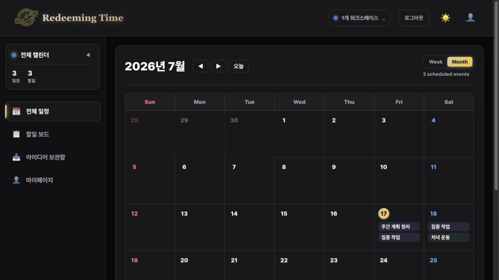
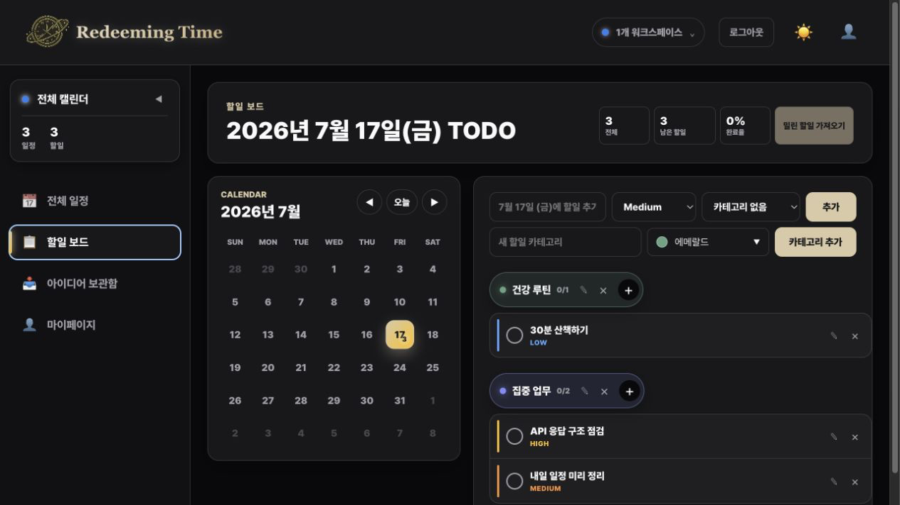

# Redeeming Time

> 흩어진 일정과 할일을 하나의 흐름으로 정리하는 웹 플래너

[](https://github.com/kangdy25/Redeeming_Time/actions/workflows/ci.yml)
[](https://redeeming-time.vercel.app)

**[웹 앱 바로가기](https://redeeming-time.vercel.app)** · **[API 문서](https://redeeming-time.vercel.app/api/docs/)**

Redeeming Time은 일정, 할일, 아이디어를 한 곳에서 관리하도록 만든 DRF 학습 프로젝트입니다.
일정과 할일을 분리하지 않고 달력 흐름 안에서 다루며, 놓친 할일은 다음 날로 이어서 관리할 수 있습니다.

## 화면 미리보기

| 달력 대시보드                                             | 할일 보드                                           |
| --------------------------------------------------------- | --------------------------------------------------- |
|  |  |

> 스크린샷은 로컬 익명 데모 데이터로 생성했으며 실제 사용자 정보나 일정은 포함하지 않습니다.

## 주요 기능

- **워크스페이스와 통합 달력**: 개인 목적에 맞는 워크스페이스를 만들고 전환할 수 있습니다.
- **일정 관리**: 일정 생성·수정·삭제, 날짜별 일정 목록 및 상세 확인, 반복 일정과 종일 일정 설정을 지원합니다.
- **할일 보드**: 카테고리별 할일, 우선순위, 목표 날짜, 완료 처리와 미완료 할일 이월 기능을 제공합니다.
- **아이디어 보관함**: 떠오른 생각을 빠르게 기록하고 정리할 수 있습니다.
- **테마와 색상 시스템**: 라이트/다크 테마 및 12가지 일정·카테고리 프리셋 색상을 제공합니다.
- **인증**: 이메일·비밀번호 JWT 로그인과 Google, Kakao OAuth 2.0 로그인을 지원합니다.
- **API와 품질 관리**: OpenAPI/Swagger 문서, 단위 테스트, 브라우저 E2E 테스트, GitHub Actions CI를 구성했습니다.

## 기술 스택

### Frontend


### Backend & Infrastructure


### Quality


## 프로젝트 구조

```text
├── backend/              # Django REST Framework API
├── frontend/             # Vue + Vite 웹 앱
│   ├── src/              # 화면·API 클라이언트·상태·타입
│   └── e2e/              # Playwright 브라우저 테스트
├── docs/                 # 배포·ERD 등 프로젝트 문서
└── render.yaml           # Render Blueprint
```

## 로컬 실행

### 사전 요구 사항

- Python 3.13 이상과 [uv](https://docs.astral.sh/uv/)
- Node.js 22 이상과 npm

### 백엔드

```bash
cd backend
uv sync --dev
uv run manage.py migrate
uv run manage.py runserver
```

API는 기본적으로 `http://127.0.0.1:8000`에서 실행됩니다.

- Swagger UI: `http://127.0.0.1:8000/api/docs/`
- OpenAPI Schema: `http://127.0.0.1:8000/api/schema/`

### 웹 앱

```bash
cd frontend
npm ci
npm run dev
```

웹 앱은 기본적으로 `http://localhost:5173`에서 실행됩니다. 로컬 API의 기본 주소는
`http://localhost:8000/api`이며, 다른 API를 사용하려면 `VITE_API_BASE_URL`을 설정합니다.

## 테스트와 검증

```bash
# Backend
cd backend
uv run manage.py test

# Frontend
cd frontend
npm run test
npm run test:e2e
npm run lint
npm run format:check
npm run build:web
npm run typecheck
```

GitHub Actions는 `main` 브랜치 푸시와 Pull Request에서 백엔드·프론트엔드·Playwright E2E 검증을 실행합니다.

## 배포 구조

```text
Browser
  ↓
Vercel (Vue Web) ── /api/* rewrite ──→ Render (Django REST Framework)
                                              ↓
                                     Neon PostgreSQL + Render Key Value
```

- 웹 앱은 **Vercel**에 배포되며 `/api/*` 요청은 같은 도메인 경로를 통해 Render API로 전달됩니다.
- API는 **Render**에, 운영 PostgreSQL은 **Neon**에 배포됩니다.
- 인증 요청 제한과 OAuth 일회성 상태는 Render Key Value를 사용합니다.
- 상세 환경변수와 배포 절차는 [백엔드 배포 가이드](docs/backend-deployment.md)에서 확인할 수 있습니다.

## 개발·배포 참고

- 무료 Render Web Service는 유휴 상태에서 첫 요청이 느릴 수 있습니다.
- 무료 Render는 SMTP 포트를 차단하므로 현재 운영 환경에서는 이메일 인증·비밀번호 재설정 메일의 실제 발송이 제한됩니다. 소셜 로그인은 정상적으로 사용할 수 있습니다.
- OAuth 클라이언트 비밀값, JWT 서명 키, Neon 연결 문자열 등 모든 비밀값은 저장소에 커밋하지 않습니다.

## 학습 포인트

- DRF ViewSet, Serializer, Permission, Pagination을 이용한 REST API 설계
- JWT와 OAuth 2.0 Authorization Code Flow의 안전한 연동
- Vue Composition API·Pinia·TanStack Vue Query를 이용한 웹 상태와 API 관리
- Vercel·Render·Neon 분리 배포와 CORS, 프록시, 환경변수 구성
- Vitest·Playwright·GitHub Actions를 활용한 자동 검증

---

> “세월을 아끼라 때가 악하니라” — 에베소서 5:16
